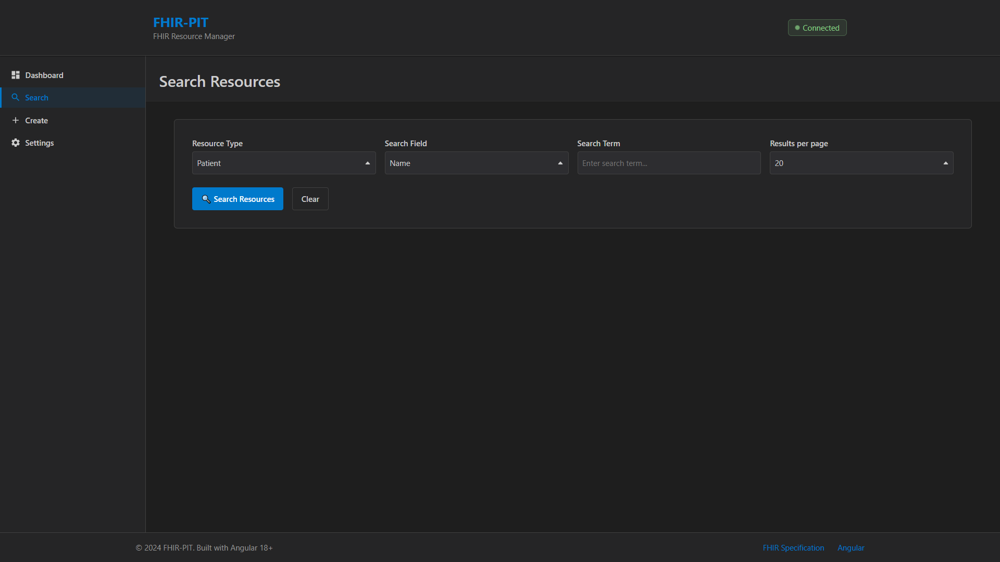
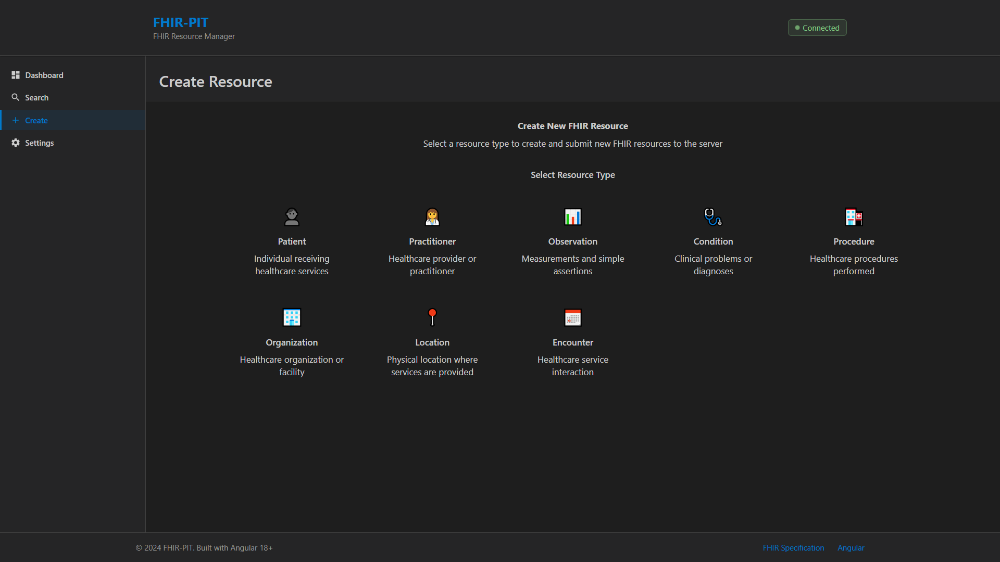
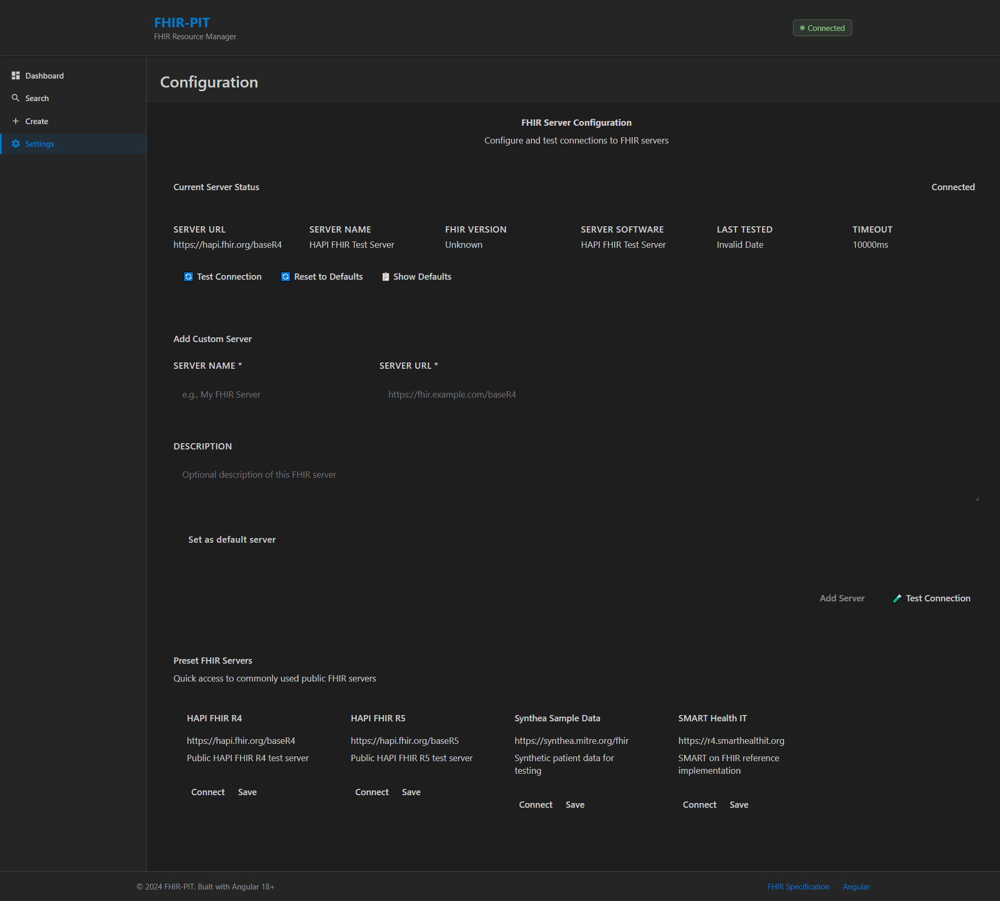

# FHIR-PIT (FHIR Practical Integration Tool)

A comprehensive Angular-based web application for testing, managing, and interacting with FHIR (Fast Healthcare Interoperability Resources) servers. This tool provides healthcare developers and implementers with an intuitive interface to work with FHIR R4 resources.

## Features

- **🔍 Resource Search**: Advanced search capabilities across all FHIR resource types with filtering and pagination
- **📊 Dashboard**: Real-time server status monitoring and resource statistics
- **📝 Resource Creation**: Form-based creation of FHIR resources including Patient, Practitioner, Organization, and more
- **🔧 Server Configuration**: Easy FHIR server endpoint configuration with connection testing
- **👀 Resource Viewer**: Detailed view and navigation of FHIR resources with reference following
- **⚡ Real-time Updates**: Reactive state management with Angular signals for instant UI updates

### Supported FHIR Resources

- Patient, Practitioner, Organization, Location
- Observation, Condition, Procedure, MedicationStatement
- Encounter, DiagnosticReport, Immunization, AllergyIntolerance
- Coverage

## Screenshots

### Main Dashboard

The main dashboard provides an overview of server status and quick access to all features.


### Resource Search Interface

Advanced search interface with filtering capabilities and pagination support.



### Resource Creation Selection

Select from various FHIR resource types to create new healthcare data.



### Patient Creation Form

Comprehensive form for creating Patient resources with validation.


### Server Configuration

Configure FHIR server connections with preset options and custom endpoints.



## Technologies

- **Angular 20.2** - Modern Angular framework with standalone components
- **Angular Material** - UI component library for consistent design
- **FHIR R4** - Healthcare data exchange standard
- **TypeScript** - Type-safe development
- **RxJS** - Reactive programming for data flow
- **Playwright** - End-to-end testing framework

## Development server

To start a local development server, run:

```bash
npm start
```

Or using Angular CLI:

```bash
ng serve
```

Once the server is running, open your browser and navigate to `http://localhost:4200/`. The application will automatically reload whenever you modify any of the source files.

## Getting Started

1. **Clone the repository**

   ```bash
   git clone <repository-url>
   cd fhir-pit
   ```

2. **Install dependencies**

   ```bash
   npm install
   ```

3. **Start the development server**

   ```bash
   npm start
   ```

4. **Configure FHIR Server**
   - Navigate to the Configuration page in the app
   - Enter your FHIR server URL (default: `http://localhost:8080/fhir`)
   - Test the connection to ensure it's working
   - Save your configuration

## Usage

### Using the Dashboard

The main dashboard provides an overview of your FHIR server status and quick access to all features.

### Searching Resources

- Navigate to the Search page
- Select a resource type (Patient, Practitioner, etc.)
- Use the search filters to find specific resources
- Browse results with pagination support

### Creating Resources

- Go to the Create page
- Select the type of resource you want to create
- Fill out the form with the required information
- Submit to create the resource on your FHIR server

### Configuring the Server

- Set your FHIR server endpoint
- Test server connectivity
- Manage connection settings and API keys (if required)

## Project Structure

```text
src/
├── app/
│   ├── components/          # UI components
│   │   ├── dashboard/       # Main dashboard
│   │   ├── search/          # Resource search
│   │   ├── create/          # Resource creation
│   │   ├── config/          # Server configuration
│   │   ├── resource-viewer/ # Resource details view
│   │   └── resource-forms/  # Form components for each resource type
│   ├── services/            # Angular services
│   │   └── fhir.service.ts  # FHIR server communication
│   └── environments/        # Environment configurations
├── styles.scss             # Global styles
└── index.html              # Main HTML file
```

## Building

To build the project for production:

```bash
npm run build
```

This will compile your project and store the build artifacts in the `dist/` directory. The production build is optimized for performance and speed.

## Testing

### Unit Tests

To execute unit tests with the [Karma](https://karma-runner.github.io) test runner:

```bash
npm test
```

### End-to-End Tests

For end-to-end testing with Playwright:

```bash
npx playwright test
```

## FHIR Server Requirements

This application is designed to work with any FHIR R4 compliant server. Popular options include:

- **HAPI FHIR Server** - Open source Java implementation
- **Microsoft FHIR Server** - Azure-based FHIR service
- **Google Cloud Healthcare API** - Google's FHIR implementation
- **AWS HealthLake** - Amazon's FHIR service

Ensure your FHIR server supports:

- FHIR R4 specification
- JSON format responses
- CORS headers (for browser-based access)
- Basic CRUD operations (Create, Read, Update, Delete)

## Contributing

1. Fork the repository
2. Create a feature branch (`git checkout -b feature/amazing-feature`)
3. Commit your changes (`git commit -m 'Add some amazing feature'`)
4. Push to the branch (`git push origin feature/amazing-feature`)
5. Open a Pull Request

## License

This project is open source and available under the [MIT License](LICENSE).

## Additional Resources

- [FHIR R4 Specification](https://hl7.org/fhir/R4/)
- [Angular CLI Documentation](https://angular.dev/tools/cli)
- [Angular Material Components](https://material.angular.io/)
- [HAPI FHIR Documentation](https://hapifhir.io/)
