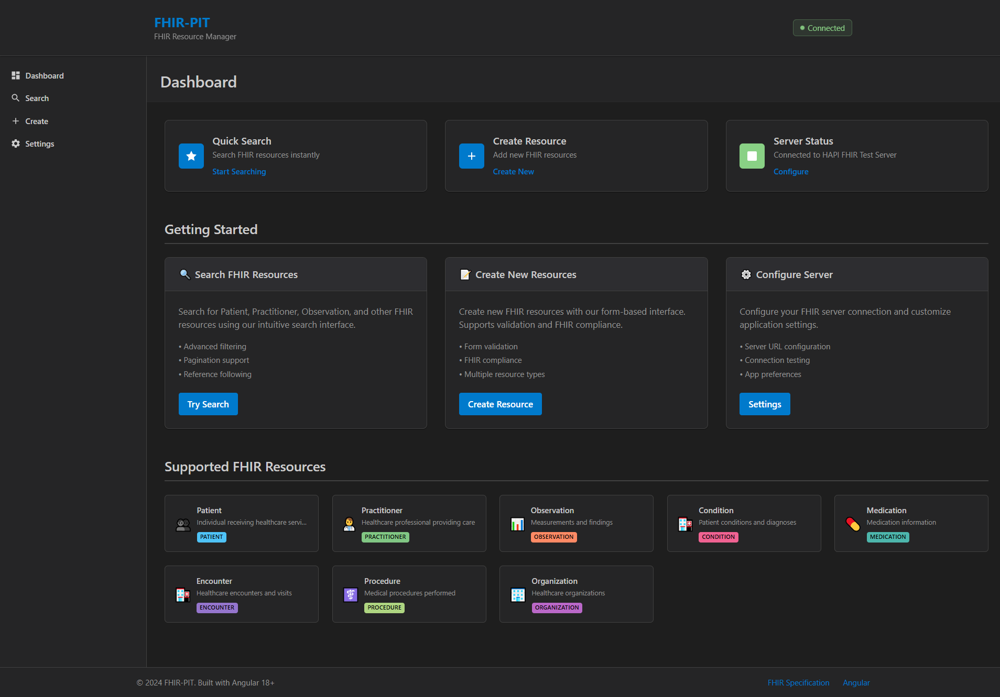

# FHIR-PIT (FHIR Practical Interface Tool)

A comprehensive Angular-based web application for testing, managing, and interacting with FHIR (Fast Healthcare Interoperability Resources) servers. This tool provides healthcare developers and implementers with an intuitive interface to work with FHIR R4 resources.

**🌐 Live Demo**: [https://vincemic.github.io/ai-fhir-pit/](https://vincemic.github.io/ai-fhir-pit/)

## Features

- **🔍 Resource Search**: Advanced search capabilities across all FHIR resource types with filtering and pagination
- **📊 Dashboard**: Real-time server status monitoring and resource statistics
- **📝 Resource Creation**: Form-based creation of FHIR resources including Patient, Practitioner, Organization, and more
- **🎲 Synthetic Data Generation**: Generate realistic synthetic FHIR data using SYNTHIA for testing and development
- **🔧 Server Configuration**: Easy FHIR server endpoint configuration with connection testing
- **👀 Resource Viewer**: Detailed view and navigation of FHIR resources with reference following
- **⚡ Real-time Updates**: Reactive state management with Angular signals for instant UI updates

### Supported FHIR Resources

- Patient, Practitioner, Organization, Location
- Observation, Condition, Procedure, MedicationStatement
- Encounter, DiagnosticReport, Immunization, AllergyIntolerance
- Coverage

## Screenshots

### Main Dashboard

The main dashboard provides an overview of server status and quick access to all features.



### Resource Search Interface

Advanced search interface with filtering capabilities and pagination support.


### Resource Creation Selection

Select from various FHIR resource types to create new healthcare data.


### Patient Creation Form

Comprehensive form for creating Patient resources with validation.


### Synthetic Data Generation

Generate realistic synthetic FHIR data for testing with configurable parameters.


### Server Configuration

Configure FHIR server connections with preset options and custom endpoints.


## Technologies

- **Angular 20.2** - Modern Angular framework with standalone components
- **Angular Material** - UI component library for consistent design
- **FHIR R4** - Healthcare data exchange standard
- **TypeScript** - Type-safe development
- **RxJS** - Reactive programming for data flow
- **Playwright** - End-to-end testing framework

## Development server

To start a local development server, run:

```bash
npm start
```

Or using Angular CLI:

```bash
ng serve
```

Once the server is running, open your browser and navigate to `http://localhost:4200/`. The application will automatically reload whenever you modify any of the source files.

## Getting Started

1. **Clone the repository**

   ```bash
   git clone <repository-url>
   cd fhir-pit
   ```

2. **Install dependencies**

   ```bash
   npm install
   ```

3. **Start the development server**

   ```bash
   npm start
   ```

4. **Configure FHIR Server**
   - Navigate to the Configuration page in the app
   - Enter your FHIR server URL (default: `http://localhost:8080/fhir`)
   - Test the connection to ensure it's working
   - Save your configuration

## Usage

### Using the Dashboard

The main dashboard provides an overview of your FHIR server status and quick access to all features.

### Searching Resources

- Navigate to the Search page
- Select a resource type (Patient, Practitioner, etc.)
- Use the search filters to find specific resources
- Browse results with pagination support

### Creating Resources

- Go to the Create page
- Select the type of resource you want to create
- Fill out the form with the required information
- Submit to create the resource on your FHIR server

### Generating Synthetic Data

- Navigate to the Synthetic Data page
- Configure generation parameters:
  - Number of patients to generate
  - Resource types to include
  - Date range for medical events
  - Locale for realistic regional data
- Choose whether to include related resources (conditions, observations, etc.)
- Click "Generate Data" to create and upload synthetic resources to your FHIR server
- Monitor progress with real-time updates

### Configuring the Server

- Set your FHIR server endpoint
- Test server connectivity
- Manage connection settings and API keys (if required)

## Project Structure

```text
src/
├── app/
│   ├── components/          # UI components
│   │   ├── dashboard/       # Main dashboard
│   │   ├── search/          # Resource search
│   │   ├── create/          # Resource creation
│   │   ├── synthetic-data/  # Synthetic data generation
│   │   ├── config/          # Server configuration
│   │   ├── resource-viewer/ # Resource details view
│   │   └── resource-forms/  # Form components for each resource type
│   ├── services/            # Angular services
│   │   ├── fhir.service.ts  # FHIR server communication
│   │   └── synthia.service.ts # Synthetic data generation
│   └── environments/        # Environment configurations
├── styles.scss             # Global styles
└── index.html              # Main HTML file
```

## Synthetic Data Generation with SYNTHIA

FHIR-PIT includes a powerful synthetic data generation feature using SYNTHIA (Synthetic Health Intelligence Assistant) to create realistic test data for your FHIR server.

### Key Features

- **Realistic Patient Data**: Generate patients with medically coherent demographics and histories
- **Related Medical Records**: Automatically create observations, conditions, procedures, and medications
- **Configurable Parameters**: Control patient count, resource types, date ranges, and localization
- **Batch Processing**: Efficient upload to FHIR server with progress monitoring
- **Medical Accuracy**: Generated data follows realistic clinical patterns and relationships

### Supported Synthetic Resources

- **Patients** with realistic demographics and identifiers
- **Observations** including vital signs and lab results
- **Conditions** with appropriate clinical coding
- **Procedures** with proper timing and relationships
- **Medications** and medication statements
- **Encounters** with realistic visit patterns
- **Practitioners** and organizations
- **Diagnostic reports** and immunizations

### Usage Benefits

- **Testing**: Populate development and testing environments quickly
- **Demonstrations**: Create realistic demos without using real patient data
- **Development**: Test application functionality with diverse datasets
- **Training**: Provide safe training environments for healthcare IT staff
- **Compliance**: Avoid PHI concerns while maintaining data realism

**Note**: All generated data is synthetic and should never be used for actual patient care.

## Building

To build the project for production:

```bash
npm run build
```

This will compile your project and store the build artifacts in the `dist/` directory. The production build is optimized for performance and speed.

## Testing

### Unit Tests

To execute unit tests with the [Karma](https://karma-runner.github.io) test runner:

```bash
npm test
```

### End-to-End Tests

For end-to-end testing with Playwright:

```bash
# Run tests headlessly
npm run test:e2e

# Run tests with UI mode for debugging
npm run test:e2e:ui

# Run tests in headed mode (see browser)
npm run test:e2e:headed

# Install Playwright browsers
npm run playwright:install
```

## Deployment

### GitHub Pages

This project is automatically deployed to GitHub Pages when changes are pushed to the main branch. The deployment workflow:

1. **Builds** the Angular application using the `github-pages` configuration
2. **Tests** the application with Playwright (test failures do not block deployment)
3. **Deploys** to GitHub Pages if the build succeeds

The live application is available at: `https://vincemic.github.io/ai-fhir-pit/`

### Manual Deployment

To build for GitHub Pages manually:

```bash
npm run build:github-pages
```

The built files will be in `dist/fhir-pit/` and can be deployed to any static hosting service.

## FHIR Server Requirements

This application is designed to work with any FHIR R4 compliant server. Popular options include:

- **HAPI FHIR Server** - Open source Java implementation
- **Microsoft FHIR Server** - Azure-based FHIR service
- **Google Cloud Healthcare API** - Google's FHIR implementation
- **AWS HealthLake** - Amazon's FHIR service

Ensure your FHIR server supports:

- FHIR R4 specification
- JSON format responses
- CORS headers (for browser-based access)
- Basic CRUD operations (Create, Read, Update, Delete)

## Contributing

1. Fork the repository
2. Create a feature branch (`git checkout -b feature/amazing-feature`)
3. Commit your changes (`git commit -m 'Add some amazing feature'`)
4. Push to the branch (`git push origin feature/amazing-feature`)
5. Open a Pull Request

## License

This project is open source and available under the [MIT License](LICENSE).

## Additional Resources

- [FHIR R4 Specification](https://hl7.org/fhir/R4/)
- [Angular CLI Documentation](https://angular.dev/tools/cli)
- [Angular Material Components](https://material.angular.io/)
- [HAPI FHIR Documentation](https://hapifhir.io/)
- [Synthea™ Patient Generator](https://synthetichealth.github.io/synthea/) - Open source synthetic patient generator
- [FHIR Testing Tools](https://confluence.hl7.org/display/FHIR/FHIR+Test+Data) - Official FHIR test data resources

